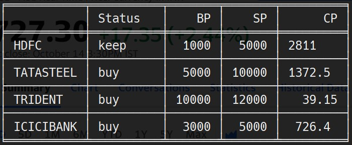

# Stock-Info
A simple terminal app that gives you LIVE stock prices and advices you to `buy`, `sell` or `keep` your stocks based on the data given.


## Installation
- Clone the git repository in your preferred directory.
As simple as that!

## Configuration
For this app to work, you need to provide a few details in `src/data.csv`.
Format: (of configuration)
```
"symbol",bp,sp # Ticker Symbol, Buy Price, Sell Price
"HDFC",5000,10000 # Example
```
Where:
- `Ticker Symbol` is the Symbol of the stock [Eg: for ICICI bank, the symbol is `ICICIBANK`].
- `Buy Price(BP)` is the price at which you would like to buy the stock.
- `Sell Price(SP)` is the price at which you would like to sell the stock.

Leave no spaces after the commas in `data.csv`

## Requirements
- Python 3.7+ 
- Certain [modules](./MODULES.md)

## Running
After the configuration, we can run Stock-Info by running the following in `src`: `python main.py` OR `python3 main.py`

It will give you a result such as this:


## Miscellaneous
- If you don't give any data, it will give an error.
- If you give wrong data(ticker symbol is not correct), it will give an error.

If you find any Issue or have a Feature Request, please open an issue.
If you have an idea for a feature, please open a PR.

#### PLEASE USE AT YOUR OWN RISK
